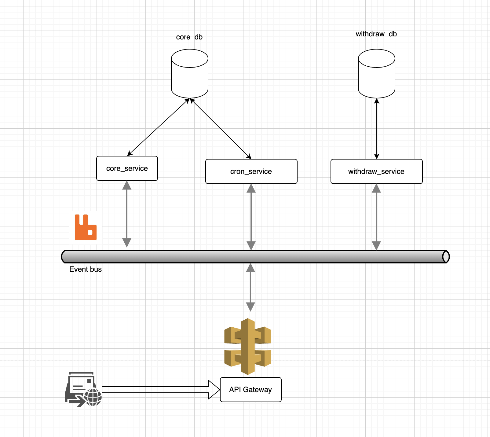

<p align="center">
  <a href="http://nestjs.com/" target="blank"></a>
</p>

[circleci-image]: https://img.shields.io/circleci/build/github/nestjs/nest/master?token=abc123def456
[circleci-url]: https://circleci.com/gh/nestjs/nest

  <p align="center">A progressive <a href="http://nodejs.org" target="_blank">Node.js</a> framework for building efficient and scalable server-side applications.</p>
    <p align="center">
<a href="https://www.npmjs.com/~nestjscore" target="_blank"></a>
<a href="https://www.npmjs.com/~nestjscore" target="_blank"></a>
<a href="https://www.npmjs.com/~nestjscore" target="_blank"></a>
<a href="https://circleci.com/gh/nestjs/nest" target="_blank"></a>
<a href="https://coveralls.io/github/nestjs/nest?branch=master" target="_blank"></a>
<a href="https://discord.gg/G7Qnnhy" target="_blank"></a>
<a href="https://opencollective.com/nest#backer" target="_blank"></a>
<a href="https://opencollective.com/nest#sponsor" target="_blank"></a>
  <a href="https://paypal.me/kamilmysliwiec" target="_blank"></a>
    <a href="https://opencollective.com/nest#sponsor"  target="_blank"></a>
  <a href="https://twitter.com/nestframework" target="_blank"></a>
</p>
  <!--[](https://opencollective.com/nest#backer)
  [](https://opencollective.com/nest#sponsor)-->

## Description

This repository belong to a backend engineer test

## Analysis requirements

The test requires to build an application that would calculate all employees’ balances at once every midnight to reflect the balance for the day.

I assume that the number of employees that need to be calculated is very large. Therefore, retrieving all the records at once to perform the calculations is not feasible.

As a result, I decided to use Batch processing techniques to handle this large number of records and I use the Microservices architecture for a scalable and reliable application.

## Infrastructure



As you can see, I have 4 difference services:

- API Gateway: Receiving and responding requests.
- Core Service: Processing the core business of Salary Hero, I don't interact with the Core Service.
- Cron Service: Executing tasks on the midnight to find the employees who working on the previous day. The cron job will not take all of the employees, instead it will take a batch of employees, then emit it to the Withdraw service to process.
- Withdraw Service: Calculating the amount of withdraw from each employee. If the employees is very large, I can auto scale this service for a better performance.

Beside that, I have 2 Databases (both of them are PostgreSQL):

- Core DB: Store users table, jobs table, working_day table.
- Withdraw DB: Store the withdraw table, this database can be replicated if necessary.

Messages from API Gateway will be sent to the Message Broker to emit it to the corresponding service, in here, I chose the RabbitMQ - a powerful and reliable broker.

## Schema

### Table: withdraw

| Column Name        | Type       | Constraints         | Description                                |
|--------------------|------------|---------------------|--------------------------------------------|
| `id`         | `int`      | `NOT NULL`, `PK`    | Primary key. Auto-generated unique identifier. |
| `user_id`          | `int`      | `NOT NULL`          | Identifier for the user.                   |
| `salary_per_day`   | `int`      |                     | Salary per day for the user.               |
| `total_working_day`| `int`      |                     | Total working days.                        |
| `total_amount`     | `int`      |                     | Total amount the user can be withdraw.          |
| `withdrawn_amount` | `int`      |                     | Amount of money withdrawn by the user.     |
| `applied_in`       | `date`     |                     | The month in which the withdrawal is applied, formatted as 'YYYY-MM'. |
| `created_at`       | `date`     |                     | Timestamp when the record was created.     |
| `updated_at`       | `date`     |                     | Timestamp when the record was last updated.|

#### Indexes

- Composite index on (`user_id`, `applied_in`).

### Table: jobs

| Column Name   | Type                                                | Constraints         | Description                                |
|---------------|-----------------------------------------------------|---------------------|--------------------------------------------|
| `id`    | `int`                                               | `NOT NULL`, `PK`    | Primary key. Auto-generated unique identifier. |
| `user_id`     | `int`                                               | `NOT NULL`, `FK1`   | Identifier for the user. Foreign key to `users.id`. |
| `type`        | `enum ["monthly-salary-rate-worker", "daily-salary-rate-worker"]` |                     | Type of job.                               |
| `base_salary` | `int`                                               |                     | Base salary for the monthly-salary-rate-worker.                   |
| `daily_salary` | `int`                                               |                     | Base salary for the daily-salary-rate-worker.                   |
| `created_at`  | `date`                                              |                     | Timestamp when the record was created.     |
| `updated_at`  | `date`                                              |                     | Timestamp when the record was last updated.|

### Table: users

| Column Name   | Type       | Constraints         | Description                                |
|---------------|------------|---------------------|--------------------------------------------|
| `id`          | `int`      | `NOT NULL`, `PK`    | Primary key. Auto-generated unique identifier. |
| `name`        | `varchar`  |                     | Name of the user.                          |
| `is_active`   | `boolean`  |                     | Whether the user is active.                |
| `created_at`  | `date`     |                     | Timestamp when the record was created.     |
| `deleted_at`  | `date`     |                     | Timestamp when the record was deleted.     |

### Table: working_day

| Column Name   | Type       | Constraints         | Description                                |
|---------------|------------|---------------------|--------------------------------------------|
| `id`          | `int`      | `NOT NULL`, `PK`    | Primary key. Auto-generated unique identifier. |
| `user_id`     | `int`      | `NOT NULL`, `FK1`   | Identifier for the user. Foreign key to `users.id`. |
| `working_time`| `smallint` |                     | Working time in hours.                     |
| `working_date`| `date`     |                     | Date of the working day.                   |

## Installation

I use Docker to build this application, so please install Docker first.

[Install Docker](https://docs.docker.com/desktop/install/mac-install/)

Clone the repository
```bash
$ git clone https://github.com/hoank97/salary-hero.git
$ cd salary-hero
```

Get the environment variables

```bash
$ touch .env
$ cp .env.example .env
```

Note: This is a test, so I publish the environment variables in the `.env.example` file.

## Running the app

```bash
# Start the application
$ yarn docker:start

# Watch logs
$ docker-compose logs -f

# Stop the application
$ yarn docker:down

```
You can heathcheck other services by access to the API documentation:

[http://localhost:3000/swagger](http://localhost:3000/swagger)

## Test

```bash
# test coverage
$ yarn run test:cov
```

## Support

Nest is an MIT-licensed open source project. It can grow thanks to the sponsors and support by the amazing backers. If you'd like to join them, please [read more here](https://docs.nestjs.com/support).

## Stay in touch

- Author - Nguyen Khanh Hoa
- Email - nguyenkhanhhoapso@gmail.com

## License

Nest is [MIT licensed](LICENSE).
